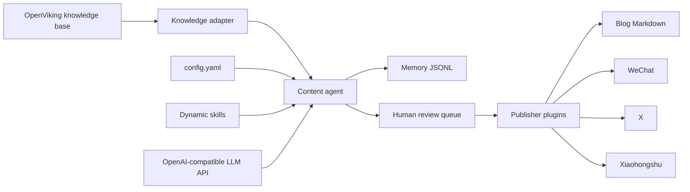

# OpenViking Content Agent

OpenViking Content Agent is a lightweight, self-hosted AI content automation platform.
It reads technical articles from a local OpenViking knowledge base, generates reviewable
content, and publishes through platform plugins.

## Architecture



## Directory Structure

```text
backend/
  app/
    agents/       # Agent orchestration
    api/          # FastAPI routes
    config/       # config.yaml loading and validation
    domain/       # Core models
    knowledge/    # OpenViking adapter
    llm/          # LLMProvider interface
    memory/       # Memory and skill proposal storage
    publishers/   # Publisher plugins
    scheduler/    # Cron jobs
    skills/       # Declarative skill plugins
config/
tests/
knowledge/
data/
```

## Quick Start

```bash
uv sync --extra dev
cp config/config.yaml config/local.yaml
export DEEPSEEK_API_KEY="your-deepseek-api-key"
OPENVIKING_AGENT_CONFIG=config/local.yaml uv run uvicorn backend.app.main:app --reload
```

For a no-credentials demo with sample knowledge and a deterministic local LLM:

```bash
bash scripts/demo.sh
```

This uses `config/demo.yaml`, reads `examples/knowledge/`, writes reviewable drafts to
`data/demo-memory.jsonl`, and keeps all publishers in dry-run mode.

Run the local acceptance check before publishing changes:

```bash
bash scripts/check.sh
```

The check runs the test suite, Ruff, demo config validation, OpenViking ingestion, status,
publisher checks, generation, and review queue listing. You can pass another config path:

```bash
bash scripts/check.sh config/local.yaml
```

The same acceptance check runs in GitHub Actions on pushes and pull requests.

Then open:

```bash
curl http://localhost:8000/api/health
curl http://localhost:8000/api/status
curl http://localhost:8000/api/config/summary
```

Generate content:

```bash
curl -X POST http://localhost:8000/api/knowledge/ingest
curl -X POST http://localhost:8000/api/generate \
  -H "Content-Type: application/json" \
  -d '{"content_type":"daily_summary","platforms":["blog","wechat","x","xiaohongshu"]}'
```

Review and approve content:

```bash
curl http://localhost:8000/api/review
curl "http://localhost:8000/api/review?status=pending_review&platform=x"
curl -X POST http://localhost:8000/api/review/<content_id>/approve
curl -X POST http://localhost:8000/api/review/<content_id>/reject \
  -H "Content-Type: application/json" \
  -d '{"reason":"Needs more source detail before publishing."}'
```

Publish approved content:

```bash
curl http://localhost:8000/api/publishers/x/check
curl http://localhost:8000/api/publish/x/<content_id>/validate
curl -X POST http://localhost:8000/api/publish/x/<content_id>
```

## Docker

Edit `config/config.yaml`, then run one startup command:

```bash
docker compose up --build
```

Mount your OpenViking export or vault at `./knowledge`.
The container runs `OpenSkald validate-config` before starting the API and exposes
a Docker healthcheck at `/api/health`.

## Configuration

All deploy-time choices live in `config/config.yaml`:

- OpenAI-compatible LLM base URL, model, and API key env var
- OpenViking knowledge base path
- Scheduler cron jobs
- Scheduled OpenViking ingestion, generation, and approved-content publishing
- Publisher accounts and credentials env vars
- Human review and memory storage paths

No API keys or publishing accounts should be hardcoded in code.

Default scheduled generation includes:

- Daily Summary
- Weekly Summary
- Hot Topic Analysis
- Deep Technical Analysis

OpenViking articles are indexed by the `ingest_knowledge` schedule into
`memory.article_index_path`. Approved content is picked up by the `publish_approved`
schedule.

Generation uses the indexed articles first. If the index is empty, the agent falls back to
the configured OpenViking path. If both are empty, generation fails with a clear error instead
of creating empty drafts.

`/api/config/summary` returns a redacted runtime summary:

- Secret values are never returned.
- Secret environment variable names are shown so operators can fix deployment.
- Missing OpenViking paths and unsafe production settings are reported as issues.
- `/api/health` reports `degraded` when configuration warnings or errors exist.

## Operator CLI

The CLI uses the same services as the FastAPI app and prints JSON for automation:

```bash
uv run OpenSkald --config config/local.yaml validate-config
uv run OpenSkald --config config/local.yaml config-summary
uv run OpenSkald --config config/local.yaml status
uv run OpenSkald --config config/local.yaml knowledge-ingest
uv run OpenSkald --config config/local.yaml generate-once \
  --content-type daily_summary \
  --platform blog \
  --platform x \
  --platform wechat
uv run OpenSkald --config config/local.yaml knowledge-list --query rag
uv run OpenSkald --config config/local.yaml review-list --status pending_review
uv run OpenSkald --config config/local.yaml content-summary
uv run OpenSkald --config config/local.yaml content-failures
uv run OpenSkald --config config/local.yaml memory-timeline --limit 10
uv run OpenSkald --config config/local.yaml memory-search --query retrieval
uv run OpenSkald --config config/local.yaml skills-discover
uv run OpenSkald --config config/local.yaml review-approve --content-id <content_id>
uv run OpenSkald --config config/local.yaml publisher-check --platform x
uv run OpenSkald --config config/local.yaml publisher-check-all
uv run OpenSkald --config config/local.yaml publish-content --content-id <content_id>
uv run OpenSkald --config config/local.yaml publish-approved --platform x
```

If publishing fails, the content remains `approved` and the error is stored in
`metadata.last_publish_error`. Fix credentials or platform permissions, then retry the same
`content_id`.

Failure inspection:

```bash
uv run OpenSkald --config config/local.yaml status
uv run OpenSkald --config config/local.yaml content-summary
uv run OpenSkald --config config/local.yaml content-failures --platform x
curl http://localhost:8000/api/status
curl http://localhost:8000/api/content/summary
curl "http://localhost:8000/api/content/failures?platform=x"
```

Memory inspection:

```bash
uv run OpenSkald --config config/local.yaml knowledge-ingest
uv run OpenSkald --config config/local.yaml knowledge-list --query "openviking"
curl -X POST http://localhost:8000/api/knowledge/ingest
curl "http://localhost:8000/api/knowledge/search?q=openviking"
uv run OpenSkald --config config/local.yaml memory-timeline --platform x
uv run OpenSkald --config config/local.yaml memory-search --query "review edit"
curl "http://localhost:8000/api/memory/timeline?platform=x&limit=10"
curl "http://localhost:8000/api/memory/search?q=review%20edit"
```

## Adding a Skill

Create a folder under `backend/app/skills/<skill_name>/skill.yaml`.
Skills are declarative prompt modules and are loaded at startup.

Skill proposals are human-gated. Approved proposals create disabled drafts:

```bash
curl -X POST http://localhost:8000/api/skills/proposals \
  -H "Content-Type: application/json" \
  -d '{
    "title":"Architecture comparison writer",
    "reason":"Repeated architecture comparison posts need a reusable prompt.",
    "proposed_skill_name":"architecture_comparison_writer",
    "draft_prompt":"Compare these articles and produce a practical architecture note.\n\n{articles}",
    "content_types":["deep_technical_analysis"],
    "platforms":["wechat"]
  }'

curl http://localhost:8000/api/skills/proposals
curl -X POST http://localhost:8000/api/skills/proposals/<proposal_id>/approve \
  -H "Content-Type: application/json" \
  -d '{"note":"Draft only. Review prompt before enabling."}'
```

Generated skill drafts are written with `enabled: false`; they are never auto-executed.

The agent can also discover proposals from memory:

```bash
uv run OpenSkald --config config/local.yaml skills-discover
curl -X POST http://localhost:8000/api/skills/proposals/discover
```

Discovery only creates pending proposals. A human must approve a proposal before a disabled
skill draft is materialized, and the draft remains `enabled: false` until edited deliberately.

## Adding a Publisher

Create `backend/app/publishers/<platform>/publisher.py` with a `PluginPublisher` class.
The core orchestration does not need to change.

Each publisher can implement `validate(content)` to enforce platform rules before a
post is published. Validation failures are stored in content metadata and do not
change the item to `published`.

Built-in publishers:

- `blog`: writes Markdown files to the directory configured by `account_id`.
- `wechat`: uses WeChat Official Account APIs when `dry_run: false`.
- `x`: posts an X thread through the X API when `dry_run: false`.
  Requires OAuth 1.0a User Context credentials, or an OAuth 2.0 User Context token,
  with write/post permission for `POST /2/tweets`.
- `xiaohongshu`: uses an experimental creator-web cookie adapter when `dry_run: false`.
  Verify with a real note publish before relying on it for unattended production.

Production credential env vars must be JSON objects:

```bash
export X_PUBLISHER_CREDENTIALS='{"api_key":"YOUR_CONSUMER_KEY","api_key_secret":"YOUR_CONSUMER_SECRET","access_token":"YOUR_ACCESS_TOKEN","access_token_secret":"YOUR_ACCESS_TOKEN_SECRET"}'
export WECHAT_PUBLISHER_CREDENTIALS='{"app_id":"wx_xxx","app_secret":"xxx","thumb_media_id":"xxx"}'
export XIAOHONGSHU_PUBLISHER_CREDENTIALS='{"cookie":"YOUR_CREATOR_COOKIE"}'
```

For X, app permissions must be Read and Write, and Access Token and Secret must be
regenerated after changing permissions. App-only bearer tokens are rejected because
they cannot publish user tweets.

X live-send checklist:

```bash
export X_PUBLISHER_CREDENTIALS='{"api_key":"YOUR_CONSUMER_KEY","api_key_secret":"YOUR_CONSUMER_SECRET","access_token":"YOUR_ACCESS_TOKEN","access_token_secret":"YOUR_ACCESS_TOKEN_SECRET"}'

uv run OpenSkald --config config/config.yaml validate-config
uv run OpenSkald --config config/config.yaml publisher-check --platform x
uv run OpenSkald --config config/config.yaml generate-once \
  --content-type daily_summary \
  --platform x
uv run OpenSkald --config config/config.yaml review-list \
  --status pending_review \
  --platform x
uv run OpenSkald --config config/config.yaml review-approve --content-id <content_id>
uv run OpenSkald --config config/config.yaml publish-content --content-id <content_id>
```

API equivalent:

```bash
curl http://localhost:8000/api/publishers/x/check
curl http://localhost:8000/api/publishers/checks
curl -X POST http://localhost:8000/api/review/<content_id>/approve
curl -X POST http://localhost:8000/api/publish/x/<content_id>
```

For production, keep `enabled: false` until credentials and platform permissions are verified.
The app validates production config and reports missing credentials before startup checks pass.

## Production Notes

- Keep `review.require_human_approval` enabled for publishing accounts.
- Run behind a reverse proxy with TLS.
- Store secrets in environment variables or a secret manager.
- Persist `./data` on durable storage.
- Start with the `blog` publisher and dry-run external publishers.
- Enable WeChat/X/Xiaohongshu one platform at a time after real account-level tests.
- Keep generated `data/` and local `knowledge/` out of Git unless publishing sample fixtures.

## Contributing

See `CONTRIBUTING.md` for development workflow and `SECURITY.md` for credential and
vulnerability reporting guidance. The repository includes an MIT license; maintainers
should confirm it matches the intended release policy before publishing.
