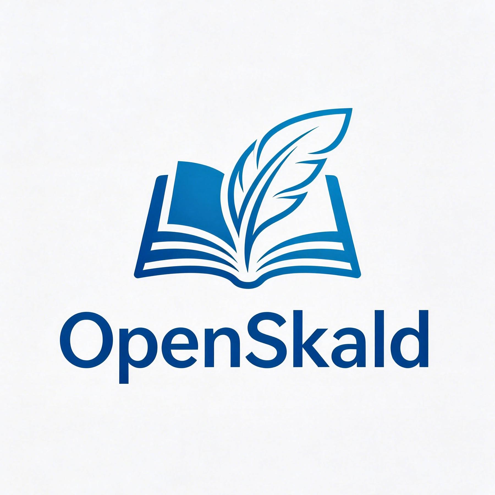
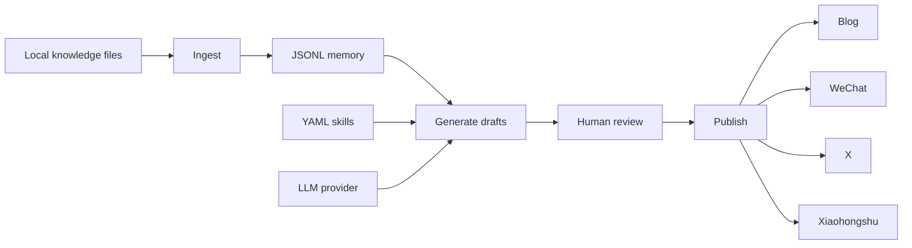

<div align="center">

<a href="https://github.com/skyloevil/OpenSkald" target="_blank">
  <picture>
    
  </picture>
</a>

### OpenSkald: Self-hosted content automation for AI knowledge workflows

English / [中文](README_CN.md)

<a href="https://github.com/skyloevil/OpenSkald">GitHub</a> · <a href="https://github.com/skyloevil/OpenSkald/issues">Issues</a> · <a href="./docs/README.md">Docs</a> · <a href="./docs/API.md">API</a>

[![][release-shield]][release-link]
[![][github-stars-shield]][github-stars-link]
[![][github-issues-shield]][github-issues-shield-link]
[![][github-contributors-shield]][github-contributors-link]
[![][license-shield]][license-shield-link]
[![][last-commit-shield]][last-commit-shield-link]

</div>

***

OpenSkald turns a local knowledge base into reviewable, publishable content. It reads
Markdown/text notes, generates drafts with declarative prompt skills and an
OpenAI-compatible LLM, stores state in JSONL memory, requires human approval by default,
and publishes through platform plugins.

It is built for teams that want a small, inspectable content agent rather than a black-box
SaaS workflow.

## Highlights

- FastAPI service and JSON-output CLI share the same runtime.
- No-credentials demo mode uses a deterministic local LLM provider.
- Supports local blog Markdown, WeChat Official Account, X threads, and Xiaohongshu notes.
- Built-in review queue keeps generated content in `pending_review` until approval.
- Publisher validation runs before real platform calls.
- Runtime memory tracks indexed articles, generated content, failures, reflections,
  metrics, skill proposals, and agent runs.
- APScheduler jobs can ingest knowledge, generate drafts, and publish approved content.

## Documentation

| Document | Purpose |
| --- | --- |
| [Documentation Index](docs/README.md) | Complete documentation map |
| [API Reference](docs/API.md) | REST endpoints, request bodies, responses, errors, and curl examples |
| [Architecture](docs/ARCHITECTURE.md) | Module layout, container wiring, agents, publishers, memory, and extension points |
| [Contributing](CONTRIBUTING.md) | Local development workflow |
| [Security](SECURITY.md) | Credential handling and vulnerability reporting |

## How It Works



## Quick Start

Run the demo first. It needs no API key and uses `examples/knowledge/`.

```bash
uv sync --extra dev
bash scripts/demo.sh
```

Run the acceptance check:

```bash
bash scripts/check.sh
```

The check runs pytest, Ruff, config validation, knowledge ingestion, status checks,
publisher checks, content generation, and review queue listing.

## Run The API

```bash
uv sync --extra dev
cp config/config.yaml config/local.yaml
export DEEPSEEK_API_KEY="your-deepseek-api-key"
OPENVIKING_AGENT_CONFIG=config/local.yaml uv run uvicorn backend.app.main:app --reload
```

Health and config:

```bash
curl http://localhost:8000/api/health
curl http://localhost:8000/api/status
curl http://localhost:8000/api/config/summary
```

Generate, review, and publish:

```bash
curl -X POST http://localhost:8000/api/knowledge/ingest

curl -X POST http://localhost:8000/api/generate \
  -H "Content-Type: application/json" \
  -d '{"content_type":"daily_summary","platforms":["blog","x"]}'

curl "http://localhost:8000/api/review?status=pending_review"
curl -X POST http://localhost:8000/api/review/<content_id>/approve
curl http://localhost:8000/api/publish/blog/<content_id>/validate
curl -X POST http://localhost:8000/api/publish/blog/<content_id>
```

See [docs/API.md](docs/API.md) for all endpoints and examples.

## CLI

```bash
uv run OpenSkald --config config/demo.yaml validate-config
uv run OpenSkald --config config/demo.yaml status
uv run OpenSkald --config config/demo.yaml knowledge-ingest
uv run OpenSkald --config config/demo.yaml generate-once \
  --content-type daily_summary \
  --platform blog \
  --platform x
uv run OpenSkald --config config/demo.yaml review-list --status pending_review
uv run OpenSkald --config config/demo.yaml review-approve --content-id <content_id>
uv run OpenSkald --config config/demo.yaml publish-content --content-id <content_id>
uv run OpenSkald --config config/demo.yaml content-failures
uv run OpenSkald --config config/demo.yaml memory-search --query retrieval
```

Useful inspection commands:

```bash
uv run OpenSkald --config config/demo.yaml config-summary
uv run OpenSkald --config config/demo.yaml content-summary
uv run OpenSkald --config config/demo.yaml memory-timeline --limit 10
uv run OpenSkald --config config/demo.yaml publisher-check-all
uv run OpenSkald --config config/demo.yaml skills-discover
uv run OpenSkald --config config/demo.yaml reflections-discover
```

## Configuration

Config is loaded from `--config`, then `OPENVIKING_AGENT_CONFIG`, then
`config/config.yaml`. The environment variable name is historical and remains the active
config variable in the current code.

Important sections:

- `llm`: provider, base URL, model, timeout, and API key environment variable.
- `openviking`: local knowledge path, include globs, and article limit.
- `scheduler`: cron jobs for ingestion, generation, and publishing.
- `publishers`: platform enablement, dry-run mode, account ID, and credentials env var.
- `review`: human approval gate and configured review queue path. Current generated
  content review state is stored with content in `memory.storage_path`.
- `memory`: JSONL paths for content, skill proposals, and indexed articles.
- `agent`: runtime mode, workspace ID, reflection, and collaboration settings.

Config summaries are redacted: secret values are never returned by the API or CLI.

## Knowledge Input

OpenSkald reads Markdown and text files from the configured knowledge path. Markdown can
include front matter:

```markdown
---
title: RAG Operations
tags:
  - rag
  - agents
url: https://example.com/source
---

# RAG Operations

Production retrieval needs memory, review, and reliable publishing checks.
```

Generation uses indexed articles first. If the index is empty, it falls back to the
configured knowledge path.

## Publishers

| Platform | Behavior |
| --- | --- |
| `blog` | Writes Markdown files to the configured local output directory |
| `wechat` | Publishes through WeChat Official Account APIs when `dry_run: false` |
| `x` | Posts one non-empty body line per tweet when `dry_run: false` |
| `xiaohongshu` | Uses an experimental creator-web cookie adapter when `dry_run: false` |

Production credential env vars must be JSON objects:

```bash
export WECHAT_PUBLISHER_CREDENTIALS='{"app_id":"wx_xxx","app_secret":"xxx","thumb_media_id":"xxx"}'
export X_PUBLISHER_CREDENTIALS='{"user_access_token":"USER_TOKEN_WITH_WRITE_SCOPE"}'
export XIAOHONGSHU_PUBLISHER_CREDENTIALS='{"cookie":"YOUR_CREATOR_COOKIE"}'
```

Keep external publishers in `dry_run: true` until `publisher-check` succeeds and a real
account-level publish has been verified.

## Skills

Skills are YAML prompt modules in `backend/app/skills/<skill_name>/skill.yaml`.
Platform-specific skills take priority over generic skills.

| Skill | Content Types | Platforms |
| --- | --- | --- |
| `article_summary` | `daily_summary`, `weekly_summary` | generic |
| `tech_analysis` | `hot_topic_analysis`, `deep_technical_analysis` | generic |
| `blog_writer` | all content types | `blog` |
| `wechat_writer` | all content types | `wechat` |
| `x_writer` | all content types | `x` |
| `xiaohongshu_writer` | all content types | `xiaohongshu` |

Skill proposals are human-gated. Approved proposals create disabled draft skills, so a
human still has to review and enable them deliberately.

## Docker

```bash
docker compose up --build
```

The container mounts `./config/config.yaml`, `./knowledge`, and `./data`, validates config
before startup, serves on port `8000`, and healthchecks `/api/health`.

## Production Notes

- Keep `review.require_human_approval: true` for publishing accounts.
- Run behind a TLS reverse proxy.
- Store secrets in environment variables or a secret manager.
- Persist `./data`; it contains memory, review state, article indexes, and run records.
- Enable real publishers one platform at a time after dry-run checks and manual review.
- Keep generated `data/` and private `knowledge/` out of Git unless publishing fixtures.

## License

OpenSkald is released under the [MIT License](LICENSE).

<!-- Link Definitions -->

[release-shield]: https://img.shields.io/github/v/release/skyloevil/OpenSkald?color=369eff&labelColor=black&logo=github&style=flat-square
[release-link]: https://github.com/skyloevil/OpenSkald/releases
[license-shield]: https://img.shields.io/badge/license-MIT-white?labelColor=black&style=flat-square
[license-shield-link]: https://github.com/skyloevil/OpenSkald/blob/main/LICENSE
[last-commit-shield]: https://img.shields.io/github/last-commit/skyloevil/OpenSkald?color=c4f042&labelColor=black&style=flat-square
[last-commit-shield-link]: https://github.com/skyloevil/OpenSkald/commits/main
[github-stars-shield]: https://img.shields.io/github/stars/skyloevil/OpenSkald?labelColor&style=flat-square&color=ffcb47
[github-stars-link]: https://github.com/skyloevil/OpenSkald
[github-issues-shield]: https://img.shields.io/github/issues/skyloevil/OpenSkald?labelColor=black&style=flat-square&color=ff80eb
[github-issues-shield-link]: https://github.com/skyloevil/OpenSkald/issues
[github-contributors-shield]: https://img.shields.io/github/contributors/skyloevil/OpenSkald?color=c4f042&labelColor=black&style=flat-square
[github-contributors-link]: https://github.com/skyloevil/OpenSkald/graphs/contributors
