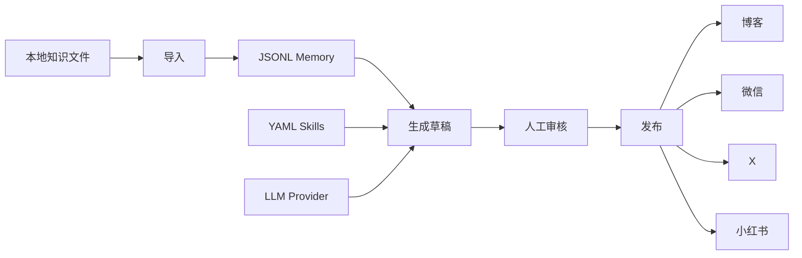

<div align="center">

<a href="https://github.com/skyloevil/OpenSkald" target="_blank">
  <picture>
    
  </picture>
</a>

### OpenSkald：面向 AI 知识工作流的自托管内容自动化服务

[English](README.md) / 中文

<a href="https://github.com/skyloevil/OpenSkald">GitHub</a> · <a href="https://github.com/skyloevil/OpenSkald/issues">Issues</a> · <a href="./docs/README_CN.md">Docs</a> · <a href="./docs/API_CN.md">API</a>

[![][release-shield]][release-link]
[![][github-stars-shield]][github-stars-link]
[![][github-issues-shield]][github-issues-shield-link]
[![][github-contributors-shield]][github-contributors-link]
[![][license-shield]][license-shield-link]
[![][last-commit-shield]][last-commit-shield-link]

</div>

***

OpenSkald 用于把本地知识库转换成可审核、可发布的内容。它读取 Markdown/text
笔记，通过声明式 Prompt Skill 和 OpenAI 兼容 LLM 生成草稿，将状态写入 JSONL
Memory，默认要求人工审核，并通过平台插件发布内容。

它适合想要可检查、可自托管内容 Agent 的团队，而不是把内容流程交给黑盒 SaaS。

## 亮点

- FastAPI 服务和 JSON 输出 CLI 共享同一套运行时。
- Demo 模式不需要 API key，使用确定性的本地 LLM Provider。
- 支持本地博客 Markdown、微信公众号、X Thread 和小红书笔记。
- 内置审核队列，生成内容默认保持 `pending_review`。
- 真实发布前会执行平台校验。
- Runtime Memory 记录文章索引、生成内容、失败信息、反思、指标、Skill 提案和运行记录。
- APScheduler 可定时导入知识、生成草稿、发布已审核内容。

## 文档

| 文档 | 用途 |
| --- | --- |
| [文档索引](docs/README_CN.md) | 完整文档地图 |
| [API 参考](docs/API_CN.md) | REST 端点、请求体、响应、错误和 curl 示例 |
| [架构说明](docs/ARCHITECTURE_CN.md) | 模块结构、容器装配、Agent、Publisher、Memory 和扩展点 |
| [贡献指南](CONTRIBUTING.md) | 本地开发流程 |
| [安全说明](SECURITY.md) | 凭据处理和漏洞报告 |

## 工作方式



## 快速开始

先运行 Demo。它不需要 API key，使用 `examples/knowledge/`。

```bash
uv sync --extra dev
bash scripts/demo.sh
```

运行验收检查：

```bash
bash scripts/check.sh
```

检查脚本会运行 pytest、Ruff、配置校验、知识导入、状态检查、发布器检查、内容生成
和审核队列查询。

## 启动 API

```bash
uv sync --extra dev
cp config/config.yaml config/local.yaml
export DEEPSEEK_API_KEY="your-deepseek-api-key"
OPENVIKING_AGENT_CONFIG=config/local.yaml uv run uvicorn backend.app.main:app --reload
```

健康检查和配置：

```bash
curl http://localhost:8000/api/health
curl http://localhost:8000/api/status
curl http://localhost:8000/api/config/summary
```

生成、审核并发布：

```bash
curl -X POST http://localhost:8000/api/knowledge/ingest

curl -X POST http://localhost:8000/api/generate \
  -H "Content-Type: application/json" \
  -d '{"content_type":"daily_summary","platforms":["blog","x"]}'

curl "http://localhost:8000/api/review?status=pending_review"
curl -X POST http://localhost:8000/api/review/<content_id>/approve
curl http://localhost:8000/api/publish/blog/<content_id>/validate
curl -X POST http://localhost:8000/api/publish/blog/<content_id>
```

完整端点和示例见 [docs/API_CN.md](docs/API_CN.md)。

## CLI

```bash
uv run OpenSkald --config config/demo.yaml validate-config
uv run OpenSkald --config config/demo.yaml status
uv run OpenSkald --config config/demo.yaml knowledge-ingest
uv run OpenSkald --config config/demo.yaml generate-once \
  --content-type daily_summary \
  --platform blog \
  --platform x
uv run OpenSkald --config config/demo.yaml review-list --status pending_review
uv run OpenSkald --config config/demo.yaml review-approve --content-id <content_id>
uv run OpenSkald --config config/demo.yaml publish-content --content-id <content_id>
uv run OpenSkald --config config/demo.yaml content-failures
uv run OpenSkald --config config/demo.yaml memory-search --query retrieval
```

常用检查命令：

```bash
uv run OpenSkald --config config/demo.yaml config-summary
uv run OpenSkald --config config/demo.yaml content-summary
uv run OpenSkald --config config/demo.yaml memory-timeline --limit 10
uv run OpenSkald --config config/demo.yaml publisher-check-all
uv run OpenSkald --config config/demo.yaml skills-discover
uv run OpenSkald --config config/demo.yaml reflections-discover
```

## 配置

配置加载顺序为 `--config`、`OPENVIKING_AGENT_CONFIG`、`config/config.yaml`。
`OPENVIKING_AGENT_CONFIG` 是历史变量名，当前代码仍然使用它。

主要配置段：

- `llm`：Provider、base URL、模型、超时和 API key 环境变量。
- `openviking`：本地知识路径、include globs 和文章数量限制。
- `scheduler`：知识导入、生成和发布任务的 cron 配置。
- `publishers`：平台启用状态、dry-run、账号 ID 和凭据环境变量。
- `review`：人工审核开关和配置中的审核队列路径。当前生成内容的审核状态会跟内容一起
  存在 `memory.storage_path`。
- `memory`：内容、Skill 提案、文章索引的 JSONL 路径。
- `agent`：运行模式、workspace ID、反思和协作配置。

API 和 CLI 返回的配置摘要都会脱敏，不会暴露密钥值。

## 知识输入

OpenSkald 从配置的知识路径读取 Markdown 和文本文件。Markdown 可包含 front matter：

```markdown
---
title: RAG Operations
tags:
  - rag
  - agents
url: https://example.com/source
---

# RAG Operations

Production retrieval needs memory, review, and reliable publishing checks.
```

生成时优先使用已索引文章；如果索引为空，则回退读取配置的知识路径。

## 发布器

| 平台 | 行为 |
| --- | --- |
| `blog` | 将 Markdown 写入配置的本地输出目录 |
| `wechat` | `dry_run: false` 时调用微信公众号接口 |
| `x` | `dry_run: false` 时按正文每个非空行发布一条 tweet |
| `xiaohongshu` | `dry_run: false` 时使用实验性的创作者 Web cookie adapter |

生产凭据环境变量必须是 JSON object：

```bash
export WECHAT_PUBLISHER_CREDENTIALS='{"app_id":"wx_xxx","app_secret":"xxx","thumb_media_id":"xxx"}'
export X_PUBLISHER_CREDENTIALS='{"user_access_token":"USER_TOKEN_WITH_WRITE_SCOPE"}'
export XIAOHONGSHU_PUBLISHER_CREDENTIALS='{"cookie":"YOUR_CREATOR_COOKIE"}'
```

在 `publisher-check` 成功并完成真实账号发布验证前，请保持外部发布器
`dry_run: true`。

## Skills

Skill 是 `backend/app/skills/<skill_name>/skill.yaml` 中的 YAML Prompt 模块。
平台专属 Skill 会优先于通用 Skill。

| Skill | 内容类型 | 平台 |
| --- | --- | --- |
| `article_summary` | `daily_summary`, `weekly_summary` | 通用 |
| `tech_analysis` | `hot_topic_analysis`, `deep_technical_analysis` | 通用 |
| `blog_writer` | 全部内容类型 | `blog` |
| `wechat_writer` | 全部内容类型 | `wechat` |
| `x_writer` | 全部内容类型 | `x` |
| `xiaohongshu_writer` | 全部内容类型 | `xiaohongshu` |

Skill 提案由人工把关。审批后的提案只会创建 `enabled: false` 的草稿 Skill，
仍需人工审核并显式启用。

## Docker

```bash
docker compose up --build
```

容器挂载 `./config/config.yaml`、`./knowledge` 和 `./data`，启动前校验配置，
在 8000 端口提供服务，并对 `/api/health` 做 healthcheck。

## 生产建议

- 发布账号请保持 `review.require_human_approval: true`。
- 放在带 TLS 的反向代理后运行。
- 密钥放入环境变量或 secret manager。
- 持久化 `./data`，其中包含 Memory、审核状态、文章索引和运行记录。
- 真实发布器按平台逐个开启，先 dry-run，再人工验证。
- 除非是示例 fixture，不要把生成的 `data/` 和私有 `knowledge/` 提交到 Git。

## 许可证

OpenSkald 使用 [MIT License](LICENSE)。

<!-- Link Definitions -->

[release-shield]: https://img.shields.io/github/v/release/skyloevil/OpenSkald?color=369eff&labelColor=black&logo=github&style=flat-square
[release-link]: https://github.com/skyloevil/OpenSkald/releases
[license-shield]: https://img.shields.io/badge/license-MIT-white?labelColor=black&style=flat-square
[license-shield-link]: https://github.com/skyloevil/OpenSkald/blob/main/LICENSE
[last-commit-shield]: https://img.shields.io/github/last-commit/skyloevil/OpenSkald?color=c4f042&labelColor=black&style=flat-square
[last-commit-shield-link]: https://github.com/skyloevil/OpenSkald/commits/main
[github-stars-shield]: https://img.shields.io/github/stars/skyloevil/OpenSkald?labelColor&style=flat-square&color=ffcb47
[github-stars-link]: https://github.com/skyloevil/OpenSkald
[github-issues-shield]: https://img.shields.io/github/issues/skyloevil/OpenSkald?labelColor=black&style=flat-square&color=ff80eb
[github-issues-shield-link]: https://github.com/skyloevil/OpenSkald/issues
[github-contributors-shield]: https://img.shields.io/github/contributors/skyloevil/OpenSkald?color=c4f042&labelColor=black&style=flat-square
[github-contributors-link]: https://github.com/skyloevil/OpenSkald/graphs/contributors
