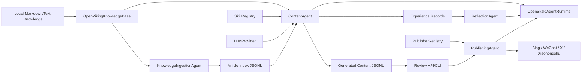

# OpenSkald Architecture

[Docs](README.md) · English / [中文](ARCHITECTURE_CN.md)

OpenSkald is a FastAPI and CLI application for converting a local knowledge base into
reviewable, publishable content. It is organized around small, replaceable services:
knowledge ingestion, declarative prompt skills, LLM generation, JSONL memory, human
review, publisher plugins, and agent runtime tracking.

## System Diagram

## Application Container

`backend/app/bootstrap.py` builds a single `AppContainer` that wires:

- `AppConfig` and config issues.
- `OpenVikingKnowledgeBase`.
- `SkillRegistry`.
- `PublisherRegistry`.
- `MemoryStore`.
- `MemoryBackend` is defined separately for future namespace-addressable memory backends,
  but the current container wires `MemoryStore` directly.
- `KnowledgeIngestionAgent`.
- `ContentAgent`.
- `PublishingAgent`.
- `SkillEvolutionAgent`.
- `ReflectionAgent`.
- `GrowthAgent`.
- `OpenSkaldAgentRuntime`.
- `AsyncIOScheduler`.

The FastAPI app and CLI use the same container construction path, so API behavior and CLI
behavior share configuration, memory, publishers, and skills.

## Layers

### Domain

`backend/app/domain/models.py` defines the Pydantic models used across the project:

- Content models: `Article`, `GeneratedContent`, `PublishResult`.
- Workflow enums: `ContentType`, `ReviewStatus`.
- Skill governance: `SkillProposal`.
- Memory and learning: `MemoryRecord`, `AgentExperience`, `AgentReflection`, `AgentMetric`.
- Runtime tracking: `AgentMode`, `AgentRunStatus`, `AgentRun`, `AgentResult`.
- Collaboration artifacts: `SourceBrief`, `PlatformDraft`, `ReviewReport`.

### Config

`backend/app/config/settings.py` loads YAML into typed config objects. The active config path
comes from `--config`, then `OPENVIKING_AGENT_CONFIG`, then `config/config.yaml`.

Validation catches:

- Empty or missing knowledge paths.
- Default model placeholders.
- Missing production LLM API key environment variables.
- Unsafe production review settings.
- Invalid scheduler actions.
- Missing publisher credentials in production.

`config_summary()` returns redacted operator-safe config. It includes env var names and
boolean configured flags, never secret values.

### Knowledge

`backend/app/knowledge/openviking.py` reads local files using configured globs. Markdown
front matter can provide `title`, `tags`, and `url`. Article IDs are stable hashes of the
absolute source path.

Articles are sorted by modification time and limited by `max_articles_per_run`.

### LLM

`backend/app/llm/provider.py` provides:

- `OpenAICompatibleProvider` for providers such as DeepSeek or OpenAI-compatible gateways.
- `DemoLLMProvider` for deterministic local tests and demos.

The OpenAI-compatible provider calls `{base_url}/chat/completions` with a system prompt and
user prompt. Missing keys, request failures, HTTP errors, and unexpected response shapes are
reported as `LLMProviderError`.

### Skills

`backend/app/skills/base.py` loads `*/skill.yaml` definitions into `PromptSkill` instances.
A skill declares:

- `name`, `version`, `enabled`, `description`.
- Supported `content_types`.
- Optional target `platforms`.
- `system_prompt`.
- `user_prompt_template` with an `{articles}` placeholder.

Platform-specific skills take priority over generic skills. Disabled skills are skipped.

### Memory

`backend/app/memory/store.py` stores state in JSONL:

- `memory.storage_path`: generated content.
- `memory.skill_proposals_path`: skill proposals.
- `memory.article_index_path`: indexed articles.
- `memory_records.jsonl`: namespaced memory records and agent runs in the same data directory.
- `review.storage_path` is part of config and appears in redacted summaries, but generated
  content review status is currently persisted with content in `memory.storage_path`.

`MemoryStore` supports article indexing, generated content lookup, review status updates,
content summaries, failure listing, timeline views, full-text substring search, skill proposal
updates, namespaced memory records, reflections, and experiences.

`backend/app/memory/backend.py` defines a `MemoryBackend` interface, a local
`JsonlMemoryBackend`, and an `OpenVikingMemoryBackend` placeholder. The remote backend
currently delegates to local JSONL fallback and exists as a future extension contract.

### Agents

Core agents:

- `KnowledgeIngestionAgent`: imports recent knowledge articles into the article index.
- `ContentAgent`: selects articles, chooses skills, calls the LLM, stores drafts, and records
  generation experiences.
- `PublishingAgent`: validates and publishes approved content, updates content status, and
  records publish failures or successes.
- `SkillEvolutionAgent`: creates, discovers, approves, and rejects skill proposals. Approved
  proposals write disabled draft skills.
- `ReflectionAgent`: distills memory experiences into reflection records.
- `GrowthAgent`: imports external metrics.
- `OpenSkaldAgentRuntime`: wraps single or collaborative runs, records run state, artifacts,
  errors, latency, and memory writes. Single mode delegates to `ContentAgent`; collaborative
  mode uses `MultiAgentOrchestrator` to research, write, review, optionally revise, store
  `pending_review` content, reflect, and run growth analysis. It does not auto-publish.

### Publishers

`PublisherRegistry` loads `backend.app.publishers.<platform>.publisher.PluginPublisher` for
each configured platform. Built-in publishers are:

- `blog`: writes Markdown files locally.
- `wechat`: creates WeChat drafts and submits them when not dry-run.
- `x`: posts tweet threads using a user access token or OAuth 1.0a credentials.
- `xiaohongshu`: uses an experimental creator-web cookie adapter.

Each publisher validates platform-specific constraints before publishing. Failed validation
does not mark content as published; errors are persisted in content metadata.

### API

`backend/app/api/routes.py` exposes routes under `/api` for:

- Health, config summary, and operational status.
- Knowledge ingestion, article listing, and article search.
- Content generation.
- Review approval and rejection.
- Content summaries, failures, memory timeline, memory search, memory records, and reflections.
- Metrics import.
- Agent runs.
- Publisher checks, validation, and publishing.
- Skill proposal governance.

See [API Reference](API.md) for the full endpoint guide.

### Scheduler

`backend/app/scheduler/jobs.py` maps five-field cron expressions to APScheduler jobs.
Supported actions:

- `ingest_knowledge`.
- `generate`.
- `publish_approved`.

The scheduler starts during FastAPI lifespan only when configured jobs exist.

## Extension Points

### Add A Publisher

1. Create `backend/app/publishers/<platform>/__init__.py`.
2. Create `backend/app/publishers/<platform>/publisher.py`.
3. Implement `PluginPublisher(Publisher)`.
4. Add the platform under `publishers` in the config.
5. Add one or more platform skills if the content format is platform-specific.

### Add A Skill

1. Create `backend/app/skills/<skill_name>/skill.yaml`.
2. Declare supported `content_types` and optional `platforms`.
3. Include a `system_prompt` and a `user_prompt_template` with `{articles}`.
4. Restart the service or rerun the CLI so `SkillRegistry` reloads it.

### Add A Content Type

1. Add a value to `ContentType`.
2. Add skills that support it.
3. Add scheduler jobs or API calls that use it.
4. Add tests for generation and any platform validation changes.

## Operational Guarantees

- Config summaries are redacted.
- Human approval is enabled by default.
- Generation never silently creates empty drafts; it fails when no articles are available.
- Publish validation happens before platform calls.
- Publish failures leave content retryable.
- Runtime state is append-only in JSONL and can be queried by run ID.
