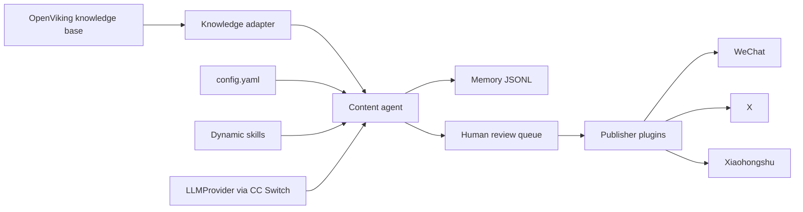

# Architecture

## Overview

OpenViking Content Agent is a self-hosted AI content automation platform. It reads
technical articles from a local OpenViking knowledge base, generates reviewable content,
and publishes through platform plugins.

## Architecture Diagram



## Directory Structure

```text
backend/
  app/
    agents/       ContentAgent, PublishingAgent, SkillEvolutionAgent
    api/          FastAPI routes (build_router)
    config/       config.yaml loading and validation (Pydantic models)
    domain/       Core models (Article, GeneratedContent, etc.)
    knowledge/    OpenViking adapter (reads local markdown files)
    llm/          LLMProvider interface (OpenAI-compatible + Demo)
    memory/       JSONL-based MemoryStore
    publishers/   Publisher plugins (wechat, x, xiaohongshu)
    scheduler/    APScheduler cron jobs
    skills/       Declarative skill plugins (YAML-driven)
config/           Configuration files
tests/            pytest test suite
data/             Runtime data (memory, review queue, skill proposals)
docs/             Documentation
knowledge/        OpenViking knowledge base mount point
```

## Layers

### Domain Layer (`domain/`)
Pure Pydantic models with no framework dependencies. Defines `Article`,
`GeneratedContent`, `ContentType`, `ReviewStatus`, `SkillProposal`, etc.

### Config Layer (`config/`)
Loads `config.yaml` into typed Pydantic models. Validates configuration and
reports issues. Never exposes secrets in API responses.

### LLM Layer (`llm/`)
Abstract `LLMProvider` interface with two implementations:
- `OpenAICompatibleProvider` — works with CC Switch, OpenAI, DeepSeek, Claude
- `DemoLLMProvider` — deterministic local mode for testing without API keys

### Knowledge Layer (`knowledge/`)
`OpenVikingKnowledgeBase` reads markdown files from a local directory. Supports
YAML frontmatter for title, tags, and URL. Returns `Article` objects sorted by
modification time.

### Skill Layer (`skills/`)
Each skill is a YAML file (`skill.yaml`) declaring:
- `name`, `version`, `enabled`, `description`
- `content_types` — which content types it handles
- `platforms` — which platforms it targets (empty = generic)
- `system_prompt` and `user_prompt_template` — LLM prompts with `{articles}` placeholder

Skills are loaded at startup. Disabled skills are skipped. Platform-specific skills
take priority over generic skills.

### Memory Layer (`memory/`)
`JsonlStore` provides append-only JSONL storage. `MemoryStore` manages content and
skill proposals. All state is stored as JSONL files in `data/`.

### Agent Layer (`agents/`)
- `ContentAgent` — orchestrates knowledge retrieval, skill selection, LLM generation,
  and memory storage
- `PublishingAgent` — publishes approved content through publisher plugins with
  validation
- `SkillEvolutionAgent` — manages skill proposals with human gating (propose, approve,
  reject). Approved proposals write disabled skill drafts.

### Publisher Layer (`publishers/`)
Each publisher is a `PluginPublisher` class extending `DryRunPublisher`. Publishers:
- Validate content against platform rules before publishing
- Default to dry-run mode (no real API calls)
- Can be replaced with real API clients without changing core code

### API Layer (`api/`)
FastAPI routes for health, config, generation, review, publishing, and skill proposals.
All routes return JSON. Secrets are never exposed.

### Scheduler Layer (`scheduler/`)
APScheduler cron jobs for periodic content generation and approved content publishing.

## Adding a New Platform

1. Create `backend/app/publishers/<platform>/__init__.py`
2. Create `backend/app/publishers/<platform>/publisher.py` with `PluginPublisher` class
3. Add publisher config to `config.yaml` under `publishers.<platform>`
4. Optionally create platform-specific skills in `backend/app/skills/<platform>_writer/`

## Adding a New Skill

1. Create `backend/app/skills/<skill_name>/skill.yaml`
2. Define `content_types`, `platforms`, and prompts
3. Restart the application to load the new skill

## Adding a New Content Type

1. Add the content type to `ContentType` enum in `domain/models.py`
2. Create skill(s) that declare the new content type
3. Add scheduler job config in `config.yaml`

## Configuration

All settings live in `config/config.yaml`. No secrets, model names, or account IDs are
hardcoded in code. Environment variables are referenced by name and resolved at runtime.

See `config/demo.yaml` for a no-credentials demo configuration.

## Deployment

### Local Development
```bash
uv sync --extra dev
cp config/config.yaml config/local.yaml
OPENVIKING_AGENT_CONFIG=config/local.yaml uv run uvicorn backend.app.main:app --reload
```

### Docker
```bash
docker compose up --build
```

### CLI
```bash
uv run openviking-agent --config config/local.yaml validate-config
uv run openviking-agent --config config/local.yaml generate-once \
  --content-type daily_summary --platform x
```
