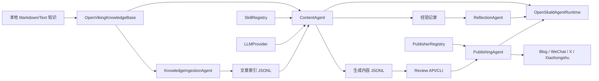

# OpenSkald 架构说明

[文档](README_CN.md) · [English](ARCHITECTURE.md) / 中文

OpenSkald 是一个 FastAPI + CLI 应用，用于把本地知识库转换为可审核、可发布的
内容。它由一组小而可替换的服务组成：知识导入、声明式 Prompt Skill、LLM 生成、
JSONL Memory、人工审核、发布器插件和 Agent Runtime 跟踪。

## 系统图

## 应用容器

`backend/app/bootstrap.py` 会构建一个 `AppContainer`，统一装配：

- `AppConfig` 和配置问题。
- `OpenVikingKnowledgeBase`。
- `SkillRegistry`。
- `PublisherRegistry`。
- `MemoryStore`。
- `MemoryBackend` 已单独定义，用于未来的命名空间 Memory 后端；但当前容器仍直接装配
  `MemoryStore`。
- `KnowledgeIngestionAgent`。
- `ContentAgent`。
- `PublishingAgent`。
- `SkillEvolutionAgent`。
- `ReflectionAgent`。
- `GrowthAgent`。
- `OpenSkaldAgentRuntime`。
- `AsyncIOScheduler`。

FastAPI 应用和 CLI 都走同一套容器构建路径，所以 API 和 CLI 共享配置、Memory、
Publisher 和 Skill。

## 分层

### Domain

`backend/app/domain/models.py` 定义项目内通用 Pydantic 模型：

- 内容模型：`Article`、`GeneratedContent`、`PublishResult`。
- 工作流枚举：`ContentType`、`ReviewStatus`。
- Skill 治理：`SkillProposal`。
- Memory 和学习：`MemoryRecord`、`AgentExperience`、`AgentReflection`、`AgentMetric`。
- Runtime 跟踪：`AgentMode`、`AgentRunStatus`、`AgentRun`、`AgentResult`。
- 协作产物：`SourceBrief`、`PlatformDraft`、`ReviewReport`。

### Config

`backend/app/config/settings.py` 将 YAML 加载为类型化配置对象。配置路径优先级为
`--config`、`OPENVIKING_AGENT_CONFIG`、`config/config.yaml`。

配置校验会检查：

- 空知识路径或不存在的知识路径。
- 默认模型占位值。
- 生产环境缺少 LLM API key 环境变量。
- 生产环境关闭人工审核等不安全设置。
- 不支持的 Scheduler action。
- 生产环境缺少 Publisher 凭据。

`config_summary()` 返回脱敏后的运维配置摘要，只显示环境变量名和是否已配置，
不会暴露密钥值。

### Knowledge

`backend/app/knowledge/openviking.py` 按配置 globs 读取本地文件。Markdown front
matter 可提供 `title`、`tags` 和 `url`。文章 ID 是基于绝对源路径生成的稳定 hash。

文章按修改时间排序，并受 `max_articles_per_run` 限制。

### LLM

`backend/app/llm/provider.py` 提供：

- `OpenAICompatibleProvider`：用于 DeepSeek 或其他 OpenAI 兼容网关。
- `DemoLLMProvider`：用于无需密钥的确定性测试和 Demo。

OpenAI 兼容 Provider 会调用 `{base_url}/chat/completions`。缺少密钥、请求失败、
HTTP 错误、响应结构异常都会抛出 `LLMProviderError`。

### Skills

`backend/app/skills/base.py` 将 `*/skill.yaml` 加载为 `PromptSkill`。
一个 Skill 声明：

- `name`、`version`、`enabled`、`description`。
- 支持的 `content_types`。
- 可选目标 `platforms`。
- `system_prompt`。
- 带 `{articles}` 占位符的 `user_prompt_template`。

平台专属 Skill 优先于通用 Skill；disabled Skill 会被跳过。

### Memory

`backend/app/memory/store.py` 使用 JSONL 存储状态：

- `memory.storage_path`：生成内容。
- `memory.skill_proposals_path`：Skill 提案。
- `memory.article_index_path`：文章索引。
- `memory_records.jsonl`：同一 data 目录下的命名空间 MemoryRecord 和 Agent Run。
- `review.storage_path` 属于配置并会出现在脱敏摘要中，但当前生成内容的审核状态实际
  跟内容一起持久化在 `memory.storage_path`。

`MemoryStore` 支持文章索引、生成内容查询、审核状态更新、内容汇总、失败列表、
时间线、全文子字符串搜索、Skill 提案更新、命名空间 Memory、反思和经验记录。

`backend/app/memory/backend.py` 定义了 `MemoryBackend` 接口、本地
`JsonlMemoryBackend`，以及 `OpenVikingMemoryBackend` 占位实现。远程 backend
当前仍委托本地 JSONL fallback，主要作为未来扩展合同存在。

### Agents

核心 Agent：

- `KnowledgeIngestionAgent`：将最近知识文章导入文章索引。
- `ContentAgent`：选择文章、选择 Skill、调用 LLM、保存草稿并记录生成经验。
- `PublishingAgent`：校验并发布已审核内容，更新内容状态，记录发布成功或失败。
- `SkillEvolutionAgent`：创建、发现、批准、拒绝 Skill 提案。批准后写入 disabled
  草稿 Skill。
- `ReflectionAgent`：将 Memory 经验提炼为反思记录。
- `GrowthAgent`：导入外部指标。
- `OpenSkaldAgentRuntime`：包装 single/collaborative run，记录运行状态、产物、
  错误、延迟和 Memory 写入。single 模式委托 `ContentAgent`；collaborative 模式
  使用 `MultiAgentOrchestrator` 执行 research、write、review、可选 revise、存储
  `pending_review` 内容、reflection 和 growth analysis。它不会自动发布内容。

### Publishers

`PublisherRegistry` 会为每个配置平台加载
`backend.app.publishers.<platform>.publisher.PluginPublisher`。内置发布器：

- `blog`：写本地 Markdown 文件。
- `wechat`：非 dry-run 时创建微信公众号草稿并提交发布。
- `x`：使用 user access token 或 OAuth 1.0a 凭据发布 thread。
- `xiaohongshu`：使用实验性的创作者 Web cookie adapter。

每个 Publisher 都会在发布前执行平台约束校验。校验失败不会把内容标记为
`published`，错误会写入内容 metadata。

### API

`backend/app/api/routes.py` 在 `/api` 下暴露：

- 健康检查、配置摘要、运行状态。
- 知识导入、文章列表、文章搜索。
- 内容生成。
- 审核批准和拒绝。
- 内容汇总、失败列表、Memory 时间线、Memory 搜索、MemoryRecord、反思。
- 指标导入。
- Agent Run。
- Publisher 检查、发布前校验和发布。
- Skill 提案治理。

完整端点见 [API 参考](API_CN.md)。

### Scheduler

`backend/app/scheduler/jobs.py` 将五段 cron 表达式映射为 APScheduler jobs。
支持 action：

- `ingest_knowledge`。
- `generate`。
- `publish_approved`。

FastAPI lifespan 中只有在存在启用任务时才会启动 scheduler。

## 扩展点

### 新增 Publisher

1. 创建 `backend/app/publishers/<platform>/__init__.py`。
2. 创建 `backend/app/publishers/<platform>/publisher.py`。
3. 实现 `PluginPublisher(Publisher)`。
4. 在配置的 `publishers` 下加入平台配置。
5. 如果平台格式特殊，添加对应平台 Skill。

### 新增 Skill

1. 创建 `backend/app/skills/<skill_name>/skill.yaml`。
2. 声明支持的 `content_types` 和可选 `platforms`。
3. 包含 `system_prompt` 和带 `{articles}` 的 `user_prompt_template`。
4. 重启服务或重新运行 CLI，让 `SkillRegistry` 重新加载。

### 新增 Content Type

1. 在 `ContentType` 枚举中新增值。
2. 添加支持该类型的 Skill。
3. 添加对应 scheduler job 或 API 调用。
4. 为生成逻辑和平台校验补测试。

## 运维保障

- 配置摘要会脱敏。
- 默认开启人工审核。
- 没有文章时生成会明确失败，不会静默创建空草稿。
- 平台调用前会先执行发布校验。
- 发布失败后内容仍可重试。
- Runtime 状态追加写入 JSONL，可按 run ID 查询。
